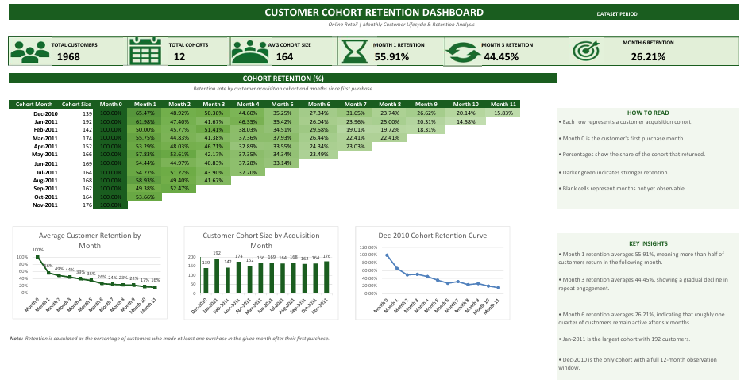

# Data Analytics Journey

Real datasets. Real problems. Documented as I work through them — no daily tutorial recaps, just the actual thinking behind each project.

## How Each Project Is Documented

Every folder in this repo follows the same structure:

- **Problem** — what needed to be solved
- **Understanding the data** — what shape the data was in and what needed attention
- **Approach** — the method and tools used to solve it
- **Solution** — the final result and what it means

## Projects

| # | Project | Problem | Result |
|---|---|---|---|
| 01 | [Data Cleaning](https://github.com/KushalReddyMarthala/excel-data-analytics-journey/tree/main/01-data-cleaning) | 105-row employee dataset with inconsistent formatting, mixed date formats, missing values, and duplicates | 105 messy rows → 100 clean, usable records |
| 02 | [Sales Analysis](https://github.com/KushalReddyMarthala/excel-data-analytics-journey/tree/main/02-sales-analysis) | 50 sales orders — which regions and categories actually drive revenue? | Found that order volume and revenue don't always align |
| 03 | [Subscription Churn](https://github.com/KushalReddyMarthala/excel-data-analytics-journey/tree/main/03-subscription-churn) | 100 subscription customers — which countries, plans, and tenure groups have the highest churn? | Found that plan type is the strongest visible churn differentiator, with churn also varying significantly by geography and tenure |
| 04 | [What-If Analysis](https://github.com/KushalReddyMarthala/excel-data-analytics-journey/tree/main/04-what-if-analysis) | How sensitive is a SaaS business's unit economics to changes in churn, CAC, and growth? | Churn could roughly double before hitting risk thresholds — but customer growth turns negative before that point |
| 05 | [Customer Cohort Retention Dashboard](https://github.com/KushalReddyMarthala/excel-data-analytics-journey/tree/main/05-customer-cohort-retention) | How does customer retention change across acquisition cohorts and months since first purchase? | Built an end-to-end cohort retention dashboard tracking customer lifecycle and repeat engagement |

---

## Project 03 — Subscription Churn

The third project analyzes customer churn across:

- 4 countries
- Multiple geographic regions
- 3 subscription plans
- Customer tenure
- Customer risk categories

### Key Findings

- UK has the highest churn rate at 45.8%
- Australia has the lowest churn rate at 16.7%
- Basic customers have the highest churn at 60.0%
- Premium customers have the lowest churn at 13.3%
- Churn increases from 25.0% among 0–6 month customers to 47.6% among 19–24 month customers
- The initial rule-based risk model provides useful segmentation but requires additional variables to become a stronger predictive model

[View the full Subscription Churn Analysis →](https://github.com/KushalReddyMarthala/excel-data-analytics-journey/tree/main/03-subscription-churn)

---

## Project 04 — What-If Analysis

The fourth project builds a SaaS unit economics model and stress-tests it using Goal Seek, Scenario Manager, and Data Tables.

### Key Findings

- Goal Seek: churn could roughly double (5% → 10%) before the LTV:CAC ratio hit the risky 3.0 threshold — but at that same churn rate, the business was already losing more customers than it gained
- Scenario Manager: in the Worst Case scenario, MRR barely dropped versus Expected Case, but Net New Customers turned negative — revenue can look healthy right up until it isn't
- Data Table: LTV:CAC drops from 18.7 at 2% churn down to 3.1 at 12% churn, mapped across the full range in a single table

[View the full What-If Analysis →](https://github.com/KushalReddyMarthala/excel-data-analytics-journey/tree/main/04-what-if-analysis)

---

## Project 05 — Customer Cohort Retention Dashboard

The fifth project is my final Excel dashboard project, focused on understanding customer retention and lifecycle behavior using cohort analysis.

The analysis groups customers based on their first purchase month and tracks how many customers return in subsequent months.

### Project Objective

The dashboard was built to answer:

- How large is each customer acquisition cohort?
- How does retention change after the first purchase?
- Which cohorts show stronger or weaker retention?
- How quickly does customer engagement decline over time?
- What does customer retention look like across the first 12 months?

### Key Findings

- The analysis contains **1,968 customers across 12 acquisition cohorts**.
- The average cohort size is **164 customers**.
- **January 2011** is the largest cohort with **192 customers**.
- Month 1 retention averages **55.91%**, meaning more than half of customers returned in the following month.
- Month 3 retention averages **44.45%**, showing a gradual decline in repeat engagement.
- Month 6 retention falls to **26.21%**, indicating that roughly one quarter of customers remain active after six months.
- December 2010 is the only cohort with a complete 12-month observation window.

### Dashboard

[View the full Customer Cohort Retention Analysis →](https://github.com/KushalReddyMarthala/excel-data-analytics-journey/tree/main/05-customer-cohort-retention)

---

## Skills & Techniques

### Excel

- Data Cleaning
- Data Validation
- Conditional Formatting
- COUNTIFS, SUMIFS, AVERAGEIFS
- IF / Nested IF, IFS
- AND / OR
- RANK.EQ
- TEXTJOIN
- SUMPRODUCT
- VLOOKUP, INDEX + MATCH
- PivotTables
- PivotCharts
- Slicers
- Goal Seek
- Scenario Manager
- Data Tables
- Cohort Analysis
- Retention Analysis
- Dashboard Design

### Analysis

- Customer Segmentation
- Customer Retention Analysis
- Cohort Analysis
- KPI Analysis
- Data Visualization
- Business Insights
- Financial Modeling
- Sensitivity Analysis

---

## What This Journey Has Taught Me

These projects helped me move beyond learning individual Excel functions and start thinking about how Excel can be used to solve business problems.

Across the projects, I practiced:

**Cleaning data → Exploring data → Analyzing patterns → Testing assumptions → Building dashboards → Communicating insights**

The goal was not just to learn Excel features, but to understand how an analyst approaches a problem and turns data into something useful.

---

## What's Next?

Excel has given me a strong foundation for working with data.

My next step is to continue building practical projects and strengthen my skills in:

- SQL
- Power BI
- Python
- Data Analytics

